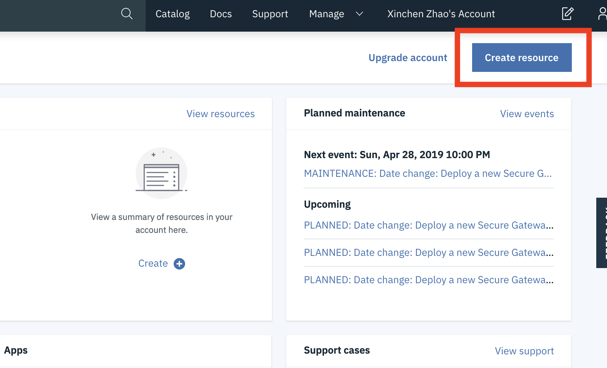
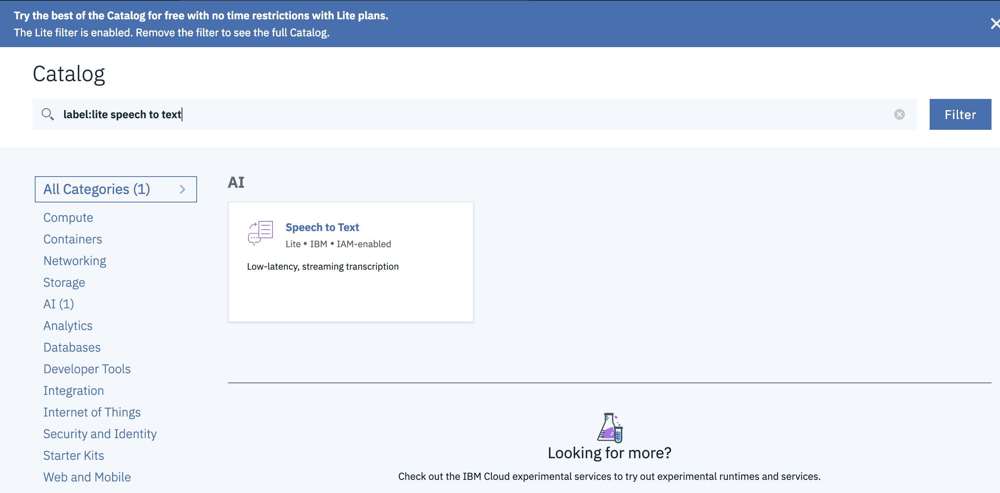
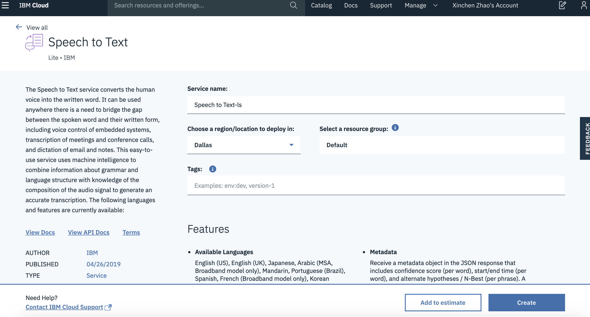

# CS52 Workshops: Cool APIs!


The Internet is an amazing place. In part because things like this exist:


But also because it has allowed for dedicated developers, whether at large corporations or part of the open source community, to build software that solves complex problems.

In the world of computer science, we care a lot about abstraction and layers. Cool APIs provide abstracted functionality to your web applications, making them robust and powerful. They can provide a lot of amazing functionality with relative ease. And, you can go around telling everyone your website incorporates ML, AI, etc!

## Overview

In this workshop, we're going to be building a web application that allows a user to speak into their microphone, then sends the audio file to the IBM Cloud to have the Watson Speech-To-Text engine return a string representing the words spoken, along with a confidence level for the accuracy of the prediction.

You could use something like this in everything from an online chatbot/customer service client, to an ordering platform!

## Setup

First you'll need to setup an account with IBM Cloud. This will get you a unique API key that you can use when sending speech-to-text requests. Follow the steps below to complete the setup:

1. Create an account: To sign up, first go [here](https://cloud.ibm.com/registration). Fill in the info needed and create an IBM account. Go to your email to click on the confirmation link. Then click Log In. **Proceed** with the acknowledgement(after reading the privcay statement of course -- like you always do).

2. Create Speech-to-Text Resource: Click **Create Resource** in the upper right corner.   



Search for **Speech for Text**, the service we'll be using today, and click on the result.



For "location to deploy in", keep it as "Dallas" and click Create.




3. Copy the credentials to authenticate to your service instance:  

- On the **Manage** page, click **Show** to view your credentials.
- Copy the API Key and URL values and save it somewhere. You'll need it for sending requests to Watson later! 


## Test API Key

Just to confirm that your API key has been activated, download the audio file linked [here](readme-content/audio-test.webm). `cd` into the directory you saved the file, then run the following curl command:

```bash
curl -X POST -u "apikey:<YOUR API KEY>" --header "Content-Type: audio/webm" --data-binary @audio-test.webm "https://stream.watsonplatform.net/speech-to-text/api/v1/recognize"
```

You should see a returned output from IBM Cloud similar to the following:


Amazing! You just sent a request to IBM Cloud that processed an audio file and returned a transcript along with a confidence level. We can see here that Watson picked up "Hello World" and is 94% confident that those words are what was said.

If you got an error, especially something that says you only sent a certain number of bytes, please flag one of us so we can help you!

Okay neat. Now that we know we can at least communicate with Watson, let's build a front-end! We don't want users to have to download an audio file, open their terminal, and run a curl command. That would be ridiculous.

Instead, let's build a tool that allows them to speak into their mic, and we handle all the rest. To get started, let's get setup.

## Clone Repo

First clone (or fork) the repository:

```bash
git clone https://github.com/dartmouth-cs52-19S/workshop-ws-04-30-cool-apis
```

Then change into the `app/` directory and install the necessary packages:

```bash
cd workshop-ws-04-03-cool-apis/app/
yarn
```

## Build Web App

Alright, let's think about what we are going to need for this web app. First, we definitely need to allow the user to speak into their microphone, and we need to hold onto that audio data. We're also going to want audio controls to start and stop the microphone. We also probably want an area for them to see the output from Watson.

Great, let's break these up into some components. Since our hierarchy is small, we don't need these to be connected components. Phew...


Okay, let's start with the microphone. On the surface, this seems kind of difficult. But, thanks to the open source community, someone has built a node package that provides a React component that acts as a microphone. It's called [react-mic](https://www.npmjs.com/package/react-mic), you should check it out!

Alright, let's add it to our project!

```bash
yarn add react-mic
```

Awesome. Now, let's add this to our project. Here's some of our component structure. Where do you think it goes?

```
├──[app]/                        # root directory
|  └──[src]                      # source files
|     └──[components]/           # contains basic components
|        └──[Recorder.js]        # handles microphone
|        └──[Output.js]          # displays IBM output
|     └──[index.js]/             # has App component
```

If you thought `Recorder.js`, you're right!


### Audio Recorder

Great, open up `Recorder.js` and you should see the basic architecture of a React component. You're probably getting some linting errors right now because we've set it up as a smart component, even thought it doesn't hold any state yet. Hold on friend, it's coming.

Before that though, let's add in `react-mic` and our styles:

```javascript
import { ReactMic } from 'react-mic';
import '../style.scss';
```

In the render function, let's return a `ReactMic` component:

```javascript
<div>
    <ReactMic
        record={this.state.record}
        className="sound-wave"
        onStop={this.onStop}
        strokeColor="#000000"
        backgroundColor="#FF4081"
    />
</div>
```

Wait... what does this do?

The `record` prop is a boolean indicating if the microphone should be recording or not. `className` should be familiar, that just allows us to target the component for styling. `onStop` is a function that is called when the microphone stops recording. `strokeColor` is the color of the sound wave, and `backgroundColor` is the color of the microphone area.

Once you paste that in, you'll probably be getting some linting errors, because our app has no state or methods. Let's fix that.  

In the constructor, add the following state:

```javascript
this.state = {
    record: false,
};
```

Then, let's add in the `onStop` method: 

```javascript
onStop = (recordedBlob) => {
    this.props.sendAudioBlob(recordedBlob.blob);
}
```

Woah props?? We haven't constructed the `App` component yet. How are we supposed to know what values it will be sending to us? Good question, friend. Let's think about it. If `App` renders `Recorder` and `Output`, it should probably handle the request to Watson, right? So, `Recorder` gets the audio from the user and sends it to `App`. `App` sends that audio file to IBM Cloud who returns a transcript and confidence level back to `App`. `App` then passes that transcript to `Output` who displays it to the user. Simple, right?

Okay, then `this.props.sendAudioBlob` is a function passed through props that will take the audio file from `Recorder` and pass it along to IBM.

But what's a blob?? Blob objects are file-like objects that hold immutable, raw data. Files actually inherit from them. Dw if it doesn't make sense, we handled all the weird file stuff for you!

Okay great! Now that we have that, we need a way to turn on the microphone. Let's add a button **underneath** the `ReactMic` component:

```html
<button onClick={this.toggleRecording} type="button">
    {this.state.record ? 'Stop' : 'Start'}
</button>
```

Then, let's add `this.toggleRecording`:

```javascript
toggleRecording = () => {
    const { record } = this.state;

    this.setState({
      record: !record,
    });

    if (!record) {
      this.props.microphoneStarted();
    }
}
```

What's `this.props.microphoneStarted`? It's another function from `App` to tell `Output` that the microphone is recording. Neat!

### Send Request to Watson

Now that `App` has the audio data in the form of a blob, let's send it onto Watson. In order to do that, we need a Node/Express server. Whaaaaaat? We haven't learned that yet. Hey, u right. Because of this, we made one for you. Go back to the root, then change into the `server directory`. Then, install the project dependencies.

```bash
cd ../../server
yarn
```

Great. We'll leave it to Tim to explain how all of this works in depth, but all you really need to know is that `src/server.js` is where our server lives. When we run this server from the command line (using `yarn start`) our app "listens" on port 9090 for incoming requests 

If you open up `src/server.js`, you'll see this on line 25:

```javascript
app.post('/', upload.single('file'), (req, res, next) => { ...
```

This sets up the base route of our server (i.e. `localhost:9090`) to be a POST request that takes in a file called `file`. In the actual function, you'll see a request being made to IBM Cloud. This basically takes the file in the form of a blob, saves it locally as a file, passes that file onto Watson, and waits for a response. Once it gets a response from Watson, it deletes the audio file on the server and sends the response to our front-end. How cool!

:rocket: On line 36 where it says `<YOUR API KEY>`, you guessed it, paste in your API key from IBM.

Okay great, back to the frontend!

### Render `Recorder`

Before we make a request to the server, let's render it in our `App` component. On the frontend, open up `index.js` and paste this into your render method:

```javascript
return (
    <div>
        <Recorder microphoneStarted={this.microphoneStarted} sendAudioBlob={this.getAudioBlob} />
    </div>
);
```

Hey look, we're passing in those two functions we talked about before as props! Better create them...

```javascript
getAudioBlob = (blob) => {
    this.setState({
        audioBlob: blob,
    });
}

microphoneStarted = () => {
    this.setState({
        audioText: 'listening...',
    });
}
```

You can see that these functions, right now, basically just set the state in `App`. `this.state.audioText` is just a string representing what to display to the user based on if the microphone is recording or not, we're waiting for IBM, etc. Here, since the microphone was turned on but we haven't sent anything to IBM yet, we display to the user that we are listening to them talk. This is because we can't send and parse the audio in real time. Once we learn web sockets, though, we will be able to!

Let's make sure to hold our state in `App`. In the constructor method, add this:

```javascript
this.state = {
    audioBlob: null,
    text: '',
    confidenceLevel: null,
    audioText: 'click the microphone to record some audio!',
};
```

Awesome! Let's test this out. Before that, we need to import `Recorder`. Add this to the top of `index.js`:

```javascript
import Recorder from './components/Recorder';
```

Great. Now make sure you're in the `app` directory, then run `yarn start`. Open up Chrome and you should see the `Recorder` component rendering. Try to record some audio, it will seem like it's recording but then nothing happens. That's because we haven't sent anything to IBM yet!

In order to do that, let's connect our front and back-ends together.

### Send Audio to Server

On the frontend, open up `index.js` and create the following function in the `App` class:

```javascript
sendRequest = () => {
    this.setState({
        audioText: 'sending a request to IBM Watson...',
    }, () => {
        const URL = 'http://localhost:9090/';

        const formData = new FormData();
        formData.append('file', this.state.audioBlob, 'recording.webm');

        const request = new XMLHttpRequest();

        request.onload = () => {
            const outputFromIBM = request.response.results[0].alternatives[0];

            this.setState({
                text: outputFromIBM.transcript,
                confidenceLevel: outputFromIBM.confidence,
                audioText: null,
            });
        };

        request.open('POST', URL, true);
        request.responseType = 'json';
        request.send(formData);
    });
}
```

What does this do? This makes a POST request to our server and passes along the audio blob. When the server responds, we save the output in our state.

But what exactly do we save? `this.state.text` is the transcript from IBM and `this.state.confidenceLevel` is the reported confidence score from IBM.

What's that `FormData` business? Just what we're using to send the binary audio file to the server. You're probably getting a linting warning about it because you haven't imported it.

Add this to the top of `index.js`:

```javascript
import FormData from 'form-data';
```

Great! Now let's display those results to our user.

### Display Results

Create the file `src/Output.js`. Then open it up, and let's import `react` + our styles:

```javascript
import React from 'react';
import '../style.scss';
```

Then, let's create the `Output` component. This component only really needs to display things. It probably won't need a state for itself. Because of this, let's make it a dumb component:

```javascript
const Output = (props) => {
  
};

export default Output;
```

Then, let's add in what we want to display:

```javascript
if (props.audioText) {
    return <p>{props.audioText}</p>;
} else {
    return (
        <div>
            <h1>{props.text}</h1>
            <h1>{props.confidenceLevel}</h1>
        </div>
    );
}
```

Can you see what this is doing? If there's some intermediary information to show the user, display it to them. Otherwise, show the transcript and confidence level from IBM.

Okay, great! Let's bring it all together now.

### Connect it Together

Go back to `index.js`. Let's import `Output`.

```javascript
import Output from './components/Output';
```

Then, let's add it to our render function. Remember what it needs as props? `audioText`, `text`, and `confidenceLevel`...

Paste this into the render function **underneath** `<Recorder ...`

```html
<Output audioText={this.state.audioText} text={this.state.text} confidenceLevel={this.state.confidenceLevel} />
```

Sweet! Let's try to bring it all together. Open up **two** terminal windows/tabs.

In one, make sure you're in the `server` directory. Then run `yarn start`.

In the other, make sure you're in the `app` directory. Then run `yarn start`.

You should see that the server is listening on port `9090` and our frontend is being served on port `8080`. If you have problems with this, flag one of us!

Great, then open up chrome and go to `localhost:8080`. Record some audio then see that your app sends the audio to IBM, waits for a response, then displays the output.

If you have problems, let us know!

## Summary

Wow look at that! You can record whatever you want and then get the transcript version of it! All for free + a little work. How neat!

## What You Learned

sadfasdfasfasdf


* Explanations of the what **and** the why behind each step. Try to include:
  * higher level concepts
  * best practices

Remember to explain any notation you are using.

```javascript
/* and use code blocks for any code! */
```


:sunglasses: GitHub markdown files [support emoji notation](http://www.emoji-cheat-sheet.com/)

Here's a resource for [github markdown](https://guides.github.com/features/mastering-markdown/).


## Summary / What you Learned

* [ ] can be checkboxes

## Reflection

*2 questions for the workshop participants to answer (very short answer) when they submit the workshop. These should try to get at something core to the workshop, the what and the why.*

* [ ] 2 reflection questions
* [ ] 2 reflection questions


## Resources

* cite any resources
